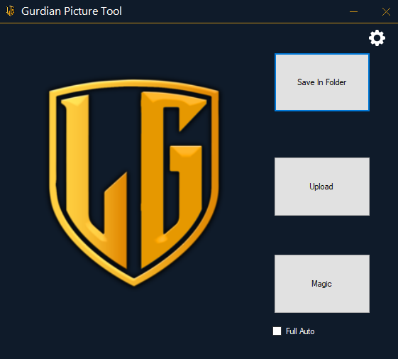
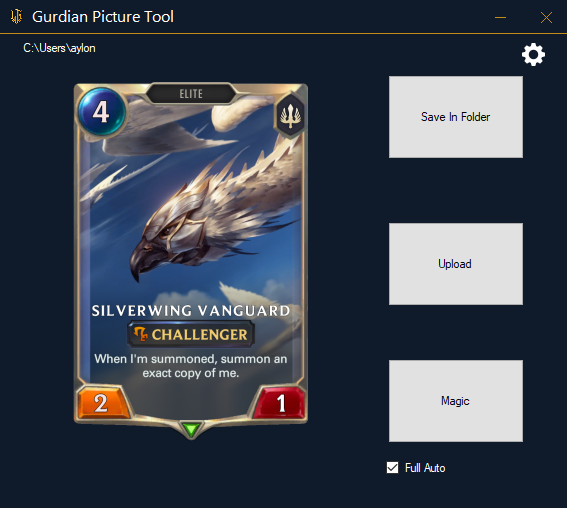
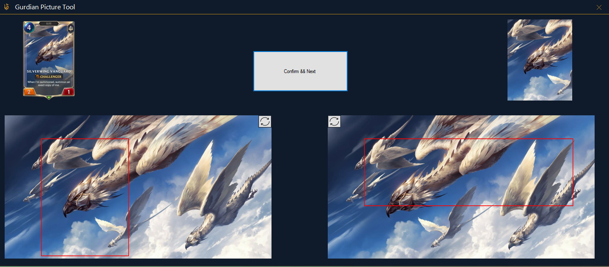
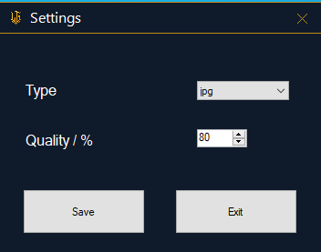

# Gurdian-Picture-Tool
> Winform application that take card anf full image of  [Legends of Runeterra](https://playruneterra.com/en-us/) 
## Table of Contents
* [General Info](#general-information)
* [Technologies Used](#technologies-used)
* [Features](#features)
* [Screenshots](#screenshots)
* [Setup](#setup)
* [Project Status](#project-status)
* [Room for Improvement](#room-for-improvement)

## General Information
The project intends to optimize the process of adding new card to the data base of [Lor Gurdian](https://lorguardian.com/app/card-library). 
This project contain's the ability to crop images to 4X5 and 10X3 (Aspect Ration)
and compress them to png or jpg at command while saving quality and transparency.
I took this project on my self to help Nadav with his job and provide him with a better tool to crop and compress the images.
My first idea was to make an application that will be able to make the full process by itself, but after small chat with the owner
we decided that it will be better to have the ability to crop it by hand and not only by the machine.

## Technologies Used
- SfForm
- Emgue.CV Version 4.5.4.4788
- Emgue.CV.Bitmap Version 4.5.4.4788
- Emgue.CV.runtime.windows Version 4.5.4.4788
- [NodeJs](https://nodejs.org/en/)
- [Sharp](https://www.npmjs.com/package/sharp)

## Features
List the ready features here:
- Set wanted quality of jpg and wanted size to compress in kb a png file
- Crop full image of specific card from the game by hand or fully automatic

## Screenshots

## Setup
The project use's a nodejs file wrapper which is handled in a diffrent folder.
In order to use the application we need to check all node modules are correctlly installed.

## Project Status
Project is: complete.

## Room for Improvement

Room for improvement:
- Improve automation Accuracy to 10X3 aspect ratio
- Improve UI, running quality and speed 
